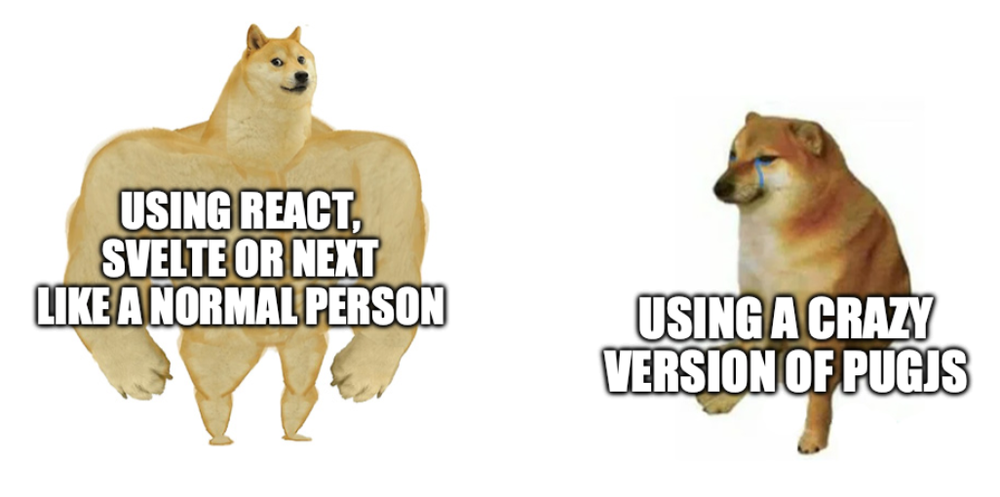

# Puggy



Puggy takes the standard pug runtime but allows the frontend to react to changes to variables defined in your script. Don't take this seriously. The code is bad but the result is fun. 

See `example/index.pug` for an example using Tailwind

## General guide

### Variables

Any variable defined in pug will be stateful. If I declare a variable, it will have a matching `set_` function.

```pug
- let count = 0

script.
  const increment = () => { set_count(count + 1) };
```

### Referencing variables

Bound variables will be updated when the state of a value has changed.

```pug
span Current count is
  b=count

button(onclick='increment()') Click me
```

### Referencing variables in attributes

Bound attributes will also update as the state of a value changes.

```pug
span This is getting
  font(size=count)
    b bigger

button(onclick='increment()') Click me
```

### Mixins

Mixins in puggy are crap:

* No support for `block` (children)
* Can only access the values passed in via parameter

```pug
mixin pet(name, type)
  li=name + ' (' + type + ')'

ul#animals
  +pet('Susan', 'cat')
  +pet('Dave', 'cat')
  +pet('Alyx', 'dog')
  +pet('biscuits', 'dog')
```

### If

It is possible to use `if`/`else` which will react to changes to the state of variables

```pug
- let loading = true

script.
  setTimeout(() => {set_loading(false)}, 1000);

mixin pet(name, type)
  li=name + ' (' + type + ')'

if loading 
  b Loading
else
  ul#animals
    +pet('Susan', 'cat')
    +pet('Dave', 'cat')
    +pet('Alyx', 'dog')
    +pet('biscuits', 'dog')
```

### Each

This example shows how an each will re-run if the state of a referenced variable is changed

```pug
- let names = ['Susan', 'Dave', 'Alyx',' biscuits']

script.
  setTimeout(() => {
    set_names([...names, `Person`]);
  }, 1500);

ul#people
  each name in names
    li=name + ' is cool'
```
